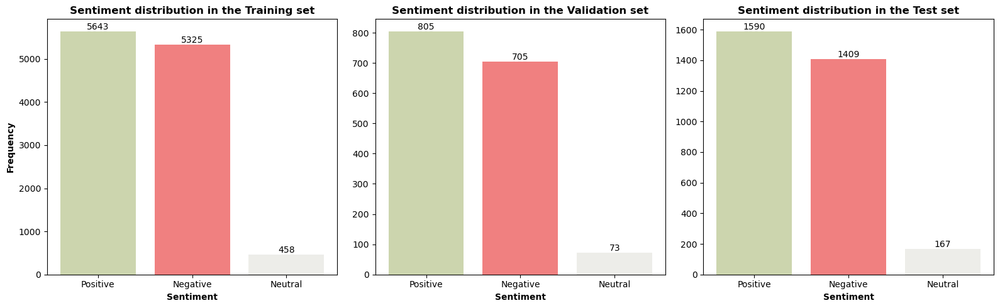

# Sentiment-Classification
The aim of this project is to build a **sentiment classification model** that effectively classifies Vietnamese student feedback into three categories: positive, negative, and neutral.

## Corpus
UIT-VSFC (version 1.0) - Vietnamese Students’ Feedback Corpus

The resource consists of over 16,000 sentences which are human-annotated on two different tasks: **sentiment-based** and **topic-based** classifications.

**Sentiment distribution**

👉 **Link to the corpus:** [Corpus](https://huggingface.co/datasets/uitnlp/vietnamese_students_feedback)

## Model architecture
The hybrid CNN-LSTM model implemented in this project following the paper: **Multi-channel LSTM-CNN model for Vietnamese sentiment analysis.**

👉 **Link to the paper:** [Paper](https://ieeexplore.ieee.org/document/8119429)

## Performance
|                  | **Precision** | **Recall** | **F1-score** |
|------------------|---------------|------------|--------------|
| **Use FastText** ❌ | 89%           | 80%        | 84%          |
| **Use FastText** ✅ | 89%           | 87%        | 88%          |

## Project structure
📂Sentiment-Classification
├──📂models
│   ├──📜lstm_cnn_model.pth # Best model for inference
│   └──📜word_to_index.json # FastText vocabularies
├──📂notebooks
│   ├──📜lstm_cnn_inference.ipynb # Notebook for inference
│   └──📜train_lstm_cnn.ipynb # Notebook for training model
├──📜.gitignore
└──📜README.md
